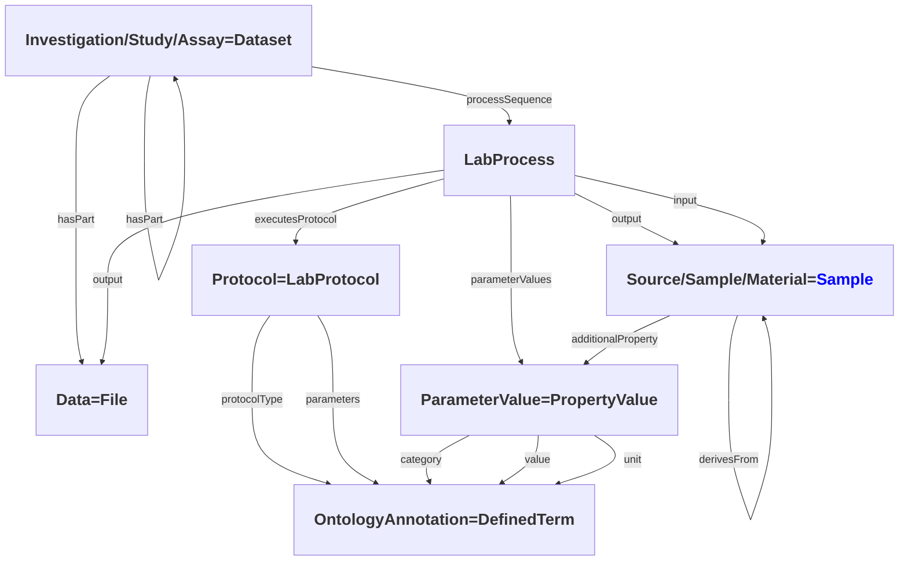

# ISA RO-Crate Profile

* Version: 0.1
* Permalink: _coming soon_
* Authors
  * Florian Wetzels - https://orcid.org/0000-0002-5526-7138
  * Lukas Weil - https://orcid.org/0000-0003-1945-6342
  * Sebastian Beier - https://orcid.org/0000-0002-2177-8781
  * Stuart Owen - https://orcid.org/0000-0003-2130-0865
  * Timo Muehlhaus - https://orcid.org/0000-0003-3925-6778

## Overview

_TODO: add some text_

_TODO: check property names on diagram edges_

## Requirements

New properties that aren't currently part of the related type are shown in _italic_.

### Investigation

| Property | Required | Expected Type | Description |
|----------|----------|---------------|-------------|
|@type |MUST|Dataset||
|@id|MUST|Text or URL|Should be “./”, the investigation object represents the root data entity.|
|additionalType|MUST|Text or URL|‘Investigation’ or ontology term to identify it as an Investigation|
|headline|MUST|Text|A title of the investigation (e.g. a paper title).|
|creator|MUST|Person|The creator(s)/authors(s)/owner(s)/PI(s) of the investigation.|
|identifier|MUST|Text or URL|Identifying descriptor of the investigation (e.g. repository name).|
|description|SHOULD|Text|A description of the investigation (e.g. an abstract).|
|hasPart|SHOULD|Dataset (Study)|An Investigation object should contain other datasets representing the *studies* of the investigation.|
|dateCreated|SHOULD|DateTime|When the Investigation was created|
|dateModified|SHOULD|DateTime|When the Investigation was last modified|
|datePublished|COULD|DateTime|When the Investigation was published|
|citation|COULD|ScholarlyArticle|Publications corresponding with this investigation.|
|comment|COULD|Comment|Comment|
|mentions|COULD|DefinedTermSet|Ontologies referenced in this investigation.|

### Study

| Property | Required | Expected Type | Description |
|----------|----------|---------------|-------------|
|@type |MUST|Dataset||
|@id|MUST|Text or URL|Should be a subdirectory corresponding to this study.|
|additionalType|MUST|Text or URL|‘Study’ or ontology term to identify it as a Study|
|creator|MUST|Person|The performer of the study.|
|identifier|MUST|Text or URL|Identifying descriptor of the study.|
|headline|MUST|Text|A title of the study.|
|hasPart|SHOULD|Dataset (Assay) or File|Assays contained in this study or actual data files resulting from the process sequence.|
|_processSequence_|SHOULD|LabProcess|The experimental processes performed in this study.|
|description|SHOULD|Text|A short description of the study (e.g. an abstract).|
|dateCreated|SHOULD|DateTime|When the Study was created|
|dateModified|SHOULD|DateTime|When the Study was last modified|
|datePublished|COULD|DateTime|When the Study was published|
|citation|COULD|ScholarlyArticle|A publication corresponding to the study.|
|comment|COULD|Comment|Comment|

### Assay

| Property | Required | Expected Type | Description |
|----------|----------|---------------|-------------|
|@type |MUST|Dataset||
|@id|MUST|Text or URL|Should be a subdirectory corresponding to this assay.|
|additionalType|MUST|Text or URL|‘Assay’ or ontology term to identify it as an Assay|
|creator|MUST|Person|The performer of the experiments.|
|identifier|MUST|Text or URL|Identifying descriptor of the assay.|
|headline|MUST|Text|A title of the assay.|
|_processSequence_|MUST|LabProcess|The experimental processes performed in this assay.|
|measurementMethod|MUST|URL or DefinedType|Describes the type measurement e.g Complexomics or transcriptomics as an ontology term|
|measurementTechnique|MUST|URL or DefinedType|Describes the type of technology used to take the measurement, e.g mass spectrometry or deep sequencing|
|hasPart|SHOULD|File|The data files resulting from the process sequence|
|description|SHOULD|Text|A short description of the assay (e.g. an abstract)|
|variableMeasured|COULD|Text or PropertyValue|The target variable being measured E.g protein concentration|
|dateCreated|SHOULD|DateTime|When the Assay was created|
|dateModified|SHOULD|DateTime|When the Assay was last modified|
|citation|COULD|ScholarlyArticle|A publication corresponding to this assay.|
|comment|COULD|Comment|Comment|

### LabProcess (_new type_)

| Property | Required | Expected Type | Description |
|----------|----------|---------------|-------------|
|@type |MUST|LabProcess||
|@id|MUST|Text or URL|Could identify the process using the isa metadata filename and the protocol reference or process name.|
|name|MUST|Text| -|
|agent|MUST|Person|The performer|
|object|MUST|Sample or File|The input|
|result|MUST|Sample or File|The output|
|executesLabProtocol|SHOULD|LabProtocol|The protocol executed|
|parameterValue|SHOULD|PropertyValue|A parameter value of the experimental process, usually a key-value pair using ontology terms|
|endTime|SHOULD|DateTime||

### LabProtocol

| Property | Required | Expected Type | Description |
|----------|----------|---------------|-------------|
|@type |MUST|LabProtocol||
|@id|MUST|Text or URL|Could be the url pointing to the protocol resource.|
|url|MUST|URL|Pointer to protocol resources external to the ISA-Tab that can be accessed by their Uniform Resource Identifier (URI).|
|headline|SHOULD|Text|Main title of the LabProtocol.|
|purpose|SHOULD|URL or DefinedType|The protocol type as an ontology term|
|description|SHOULD|Text|A short description of the protocol (e.g. an abstract)|
|comment|COULD|Comment|Comment|
|version|COULD|Number of Text|An identifier for the version to ensure protocol tracking.|
|labEquipment|COULD|DefinedTerm or Text or URL|For LabProtocols it would be a laboratory equipment use by a person to follow one or more steps described in this LabProtocol.|
|reagent|COULD|BioChemEntity or DefinedTerm or Text or URL|Reagents used in the protocol.|
|software|COULD|SoftwareApplication|Software or tool used as part of the lab protocol to complete a part of it.|
|sameAs|COULD|URL|URL of a reference Web page that unambiguously indicates the item's identity. E.g. the URL of the item's Wikipedia page, Wikidata entry, or official website.|

### Sample

| Property | Required | Expected Type | Description |
|----------|----------|---------------|-------------|
|@type |MUST|Sample||
|@id|MUST|Text or URL|Could be the unique sample name.|
|name|MUST|Text|A name identifying the sample.|
|additionalProperty|SHOULD|PropertValue|characteristics or factors|
|_derivesFrom_|COULD|Sample|A source from which the sample is derived through processes.|

### Data

| Property | Required | Expected Type | Description |
|----------|----------|---------------|-------------|
|@type |MUST|File||
|@id|MUST|File|Should be the path pointing to the file./
|name|MUST|Text or URL|The name of the file.|
|comment|COULD|Comment|Comment|
|encodingFormat|COULD|Text of URL|Media format as a MIME type|
|disambiguatingDescription|COULD|Text|The type of the data file (“Raw Data File", “Derived Data File" or "Image File").|

### PropertyValue

| Property | Required | Expected Type | Description |
|----------|----------|---------------|-------------|
|@type |MUST|PropertyValue||
|@id|MUST|Text or URL||
|name|MUST|Text|Key name|
|value|MUST|Text|Value text or number|
|propertyID|SHOULD|URL|Key ontology reference|
|unitCode|COULD|URL|Unit ontology reference|
|unitText|COULD|Text|Unit name|
|valueReference|COULD|URL|Value ontology reference|
|additionalType|COULD|Text|Can be used to describe if the value is a factor, characteristic or parameter.|

## Example ro-crate-metadata.json

_TODO: simple example and a link to a more complete example_