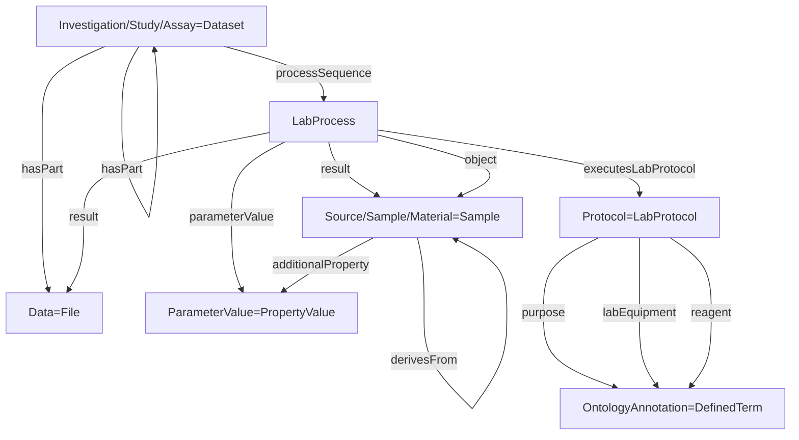

# ISA RO-Crate Profile

* Version: 0.2
* Permalink: _coming soon_
* Authors
  * Florian Wetzels - https://orcid.org/0000-0002-5526-7138
  * Lukas Weil - https://orcid.org/0000-0003-1945-6342
  * Sebastian Beier - https://orcid.org/0000-0002-2177-8781
  * Stuart Owen - https://orcid.org/0000-0003-2130-0865
  * Timo Muehlhaus - https://orcid.org/0000-0003-3925-6778

## Overview

A significant part of the previous work on this [RO-Crate](https://www.researchobject.org/ro-crate/) profile for [ISA](https://isa-tools.org/index.html) was produced as part of the [Annotated Research Context (ARC)](https://nfdi4plants.org/content/learn-more/annotated-research-context.html) project, through [arc-to-rocrate](https://github.com/nfdi4plants/arc-to-rocrate).

During the [ELIXIR Biohackathon 2023](https://biohackathon-europe.org/), as part of [Project 14: Enabling continuous RDM using Annotated Research Contexts with RO-Crate profiles for ISA](https://github.com/elixir-europe/biohackathon-projects-2023/tree/main/14), 
the profile was further fine tuned and defined, and some remaining unresolved mappings resolved.

The aim of the profile is to be able to fully represent [ISA-JSON](https://isa-specs.readthedocs.io/en/latest/isajson.html) as RO-Crate, fully capturing the metadata and files in a non-lossy form such that it
should be possible to convert between one to the other, in either direction, without loss of information.

The ISA RO-Crate has led to a few changes to [Bioschemas](https://bioschemas.org/) types:
  
**LabProtocol** - Has been redefined as a child of [HowTo](https://schema.org/HowTo) to make it clearer that it is intended to specifically describe the planned instructions for a lab process.

**LabProcess** - A new type has been defined as a child of [Action](https://schema.org/Action), to specifically describe the details and outcomes of an executed LabProtocol. 
Thereby seperating the "what was planned" and "what happened" between LabProtocol and LabProcess respectively. 
A working group is working on the new type and adaptations of existing types.

An important change to the [Bioschemas](https://bioschemas.org/) specification that is still pending is the following:

**Dataset** - A new property _processSequence_ to describe how the Dataset was created.

The following graph summarizes the ISA model in terms of [Bioschemas](https://bioschemas.org/)/[Schema.org](https://schema.org/) vocabulary:

## Requirements

### Investigation

Is based upon [schema.org/Dataset](https://schema.org/Dataset) and maps to the [ISA-JSON Investigation](https://isa-specs.readthedocs.io/en/latest/isajson.html#investigation-schema-json)

| Property | Required | Expected Type | Description |
|----------|----------|---------------|-------------|
|@type |MUST|Text|must be '[schema.org/Dataset](https://schema.org/Dataset)'|
|@id|MUST|Text or URL|Should be “./”, the investigation object represents the root data entity.|
|additionalType|MUST|Text or URL|‘Investigation’ or ontology term to identify it as an Investigation|
|identifier|MUST|Text or URL|Identifying descriptor of the investigation (e.g. repository name).|
|headline|SHOULD|Text|A title of the investigation (e.g. a paper title).|
|creator|SHOULD|[schema.org/Person](https://schema.org/Person)|The creator(s)/authors(s)/owner(s)/PI(s) of the investigation.|
|description|SHOULD|Text|A description of the investigation (e.g. an abstract).|
|hasPart|SHOULD|[schema.org/Dataset](https://schema.org/Dataset) (Study)|An Investigation object should contain other datasets representing the *studies* of the investigation. They must follow the Study profile.|
|dateCreated|SHOULD|DateTime|When the Investigation was created|
|datePublished|SHOULD|DateTime|When the Investigation was published|
|dateModified|COULD|DateTime|When the Investigation was last modified|
|citation|COULD|[schema.org/ScholarlyArticle](https://schema.org/ScholarlyArticle)|Publications corresponding with this investigation.|
|comment|COULD|[schema.org/Comment](https://schema.org/Comment)|Comment|
|mentions|COULD|[schema.org/DefinedTermSet](https://schema.org/DefinedTermSet)|Ontologies referenced in this investigation.|
|url|COULD|URL|The filename or path of the metadata file describing the investigation. Optional, since in some contexts like an ARC the filename is implicit.|

### Study

Is based upon [schema.org/Dataset](https://schema.org/Dataset) and maps to the [ISA-JSON Study](https://isa-specs.readthedocs.io/en/latest/isajson.html#study-schema-json)

| Property | Required | Expected Type | Description |
|----------|----------|---------------|-------------|
|@type |MUST|Text|must be '[schema.org/Dataset](https://schema.org/Dataset)'|
|@id|MUST|Text or URL|Should be a subdirectory corresponding to this study.|
|identifier|MUST|Text or URL|Identifying descriptor of the study.|
|additionalType|MUST|Text or URL|‘Study’ or ontology term to identify it as a Study|
|creator|SHOULD|[schema.org/Person](https://schema.org/Person)|The performer of the study.|
|headline|SHOULD|Text|A title of the study.|
|hasPart|SHOULD|[schema.org/Dataset](https://schema.org/Dataset) (Assay) or [File](https://schema.org/MediaObject)|Assays contained in this study or actual data files resulting from the process sequence.|
|about|SHOULD|[bioschemas.org/LabProcess](https://bioschemas.org/LabProcess)|The experimental processes performed in this study.|
|description|SHOULD|Text|A short description of the study (e.g. an abstract).|
|dateCreated|SHOULD|DateTime|When the Study was created|
|datePublished|SHOULD|DateTime|When the Study was published|
|dateModified|COULD|DateTime|When the Study was last modified|
|citation|COULD|[schema.org/ScholarlyArticle](https://schema.org/ScholarlyArticle)|A publication corresponding to the study.|
|comment|COULD|[schema.org/Comment](https://schema.org/Comment)|Comment|
|url|COULD|URL|The filename or path of the metadata file describing the study. Optional, since in some contexts like an ARC the filename is implicit.|

### Assay

Is based upon [schema.org/Dataset](https://schema.org/Dataset) and maps to the [ISA-JSON Assay](https://isa-specs.readthedocs.io/en/latest/isajson.html#assay-schema-json)

| Property | Required | Expected Type | Description |
|----------|----------|---------------|-------------|
|@type |MUST|Text|must be '[schema.org/Dataset](https://schema.org/Dataset)'|
|@id|MUST|Text or URL|Should be a subdirectory corresponding to this assay.|
|additionalType|MUST|Text or URL|‘Assay’ or ontology term to identify it as an Assay|
|identifier|MUST|Text or URL|Identifying descriptor of the assay.|
|about|SHOULD|[bioschemas.org/LabProcess](https://bioschemas.org/LabProcess)|The experimental processes performed in this assay.|
|creator|SHOULD|[schema.org/Person](https://schema.org/Person)|The performer of the experiments.|
|measurementMethod|SHOULD|URL or [schema.org/DefinedTerm](https://schema.org/DefinedTerm)|Describes the type measurement e.g Complexomics or transcriptomics as an ontology term|
|measurementTechnique|SHOULD|URL or [schema.org/DefinedTerm](https://schema.org/DefinedTerm)|Describes the type of technology used to take the measurement, e.g mass spectrometry or deep sequencing|
|hasPart|SHOULD|[File](https://schema.org/MediaObject)|The data files resulting from the process sequence|
|variableMeasured|COULD|Text or [schema.org/PropertyValue](https://schema.org/PropertyValue)|The target variable being measured E.g protein concentration|
|comment|COULD|[schema.org/Comment](https://schema.org/Comment)|Comment|
|url|COULD|URL|The filename or path of the metadata file describing the assay. Optional, since in some contexts like an ARC the filename is implicit.|

### LabProcess

Has the new Bioschemas DRAFT [bioschemas.org/LabProcess](https://bioschemas.org/LabProcess) type and maps to the [ISA-JSON Process](https://isa-specs.readthedocs.io/en/latest/isajson.html#process-schema-json)

| Property | Required | Expected Type | Description |
|----------|----------|---------------|-------------|
|@type |MUST|Text|must be '[bioschemas.org/LabProcess](https://bioschemas.org/LabProcess)'|
|@id|MUST|Text or URL|Could identify the process using the isa metadata filename and the protocol reference or process name.|
|name|MUST|Text| -|
|agent|MUST|[schema.org/Person](https://schema.org/Person)|The performer|
|object|MUST|[bioschemas.org/Sample](https://bioschemas.org/Sample) or [File](https://schema.org/MediaObject)|The input|
|result|MUST|[bioschemas.org/Sample](https://bioschemas.org/Sample) or [File](https://schema.org/MediaObject)|The output|
|executesLabProtocol|SHOULD|[bioschemas.org/LabProtocol](https://bioschemas.org/LabProtocol)|The protocol executed|
|parameterValue|SHOULD|[schema.org/PropertyValue](https://schema.org/PropertyValue)|A parameter value of the experimental process, usually a key-value pair using ontology terms|
|endTime|SHOULD|DateTime||

### LabProtocol

Is based on the Bioschemas [bioschemas.org/LabProtocol](https://bioschemas.org/LabProtocol) type and maps to the [ISA-JSON Protocol](https://isa-specs.readthedocs.io/en/latest/isajson.html#protocol-schema-json)  

| Property | Required | Expected Type | Description |
|----------|----------|---------------|-------------|
|@type |MUST|Text|must be '[bioschemas.org/LabProtocol](https://bioschemas.org/LabProtocol)'|
|@id|MUST|Text or URL|Could be the url pointing to the protocol resource.|
|name|SHOULD|Text|Main title of the LabProtocol.|
|intendedUse|SHOULD|[schema.org/DefinedTerm](https://schema.org/DefinedTerm) or Text or URL|The protocol type as an ontology term|
|description|SHOULD|Text|A short description of the protocol (e.g. an abstract)|
|url|COULD|URL|Pointer to protocol resources external to the ISA-Tab that can be accessed by their Uniform Resource Identifier (URI).|
|comment|COULD|[schema.org/Comment](https://schema.org/Comment)|Comment|
|version|COULD|Number or Text|An identifier for the version to ensure protocol tracking.|
|labEquipment|COULD|[schema.org/DefinedTerm](https://schema.org/DefinedTerm) or [schema.org/PropertyValue](https://schema.org/PropertyValue) or Text or URL|For LabProtocols it would be a laboratory equipment use by a person to follow one or more steps described in this LabProtocol.|
|reagent|COULD|[schema.org/BioChemEntity](https://schema.org/BioChemEntity://bioschemas.org/Sample) or [schema.org/DefinedTerm](https://schema.org/DefinedTerm) or [schema.org/PropertyValue](https://schema.org/PropertyValue) or Text or URL|Reagents used in the protocol.|
|computationalTool|COULD|[schema.org/DefinedTerm](https://schema.org/DefinedTerm) or [schema.org/PropertyValue](https://schema.org/PropertyValue) or [schema.org/SoftwareApplication](https://schema.org/SoftwareApplication)|Software or tool used as part of the lab protocol to complete a part of it.|

### Sample

Is based on the Bioschemas [bioschemas.org/Sample](https://bioschemas.org/Sample) type, and represents the ISA-JSON [Sample](https://isa-specs.readthedocs.io/en/latest/isajson.html#sample-schema-json), 
[Source](https://isa-specs.readthedocs.io/en/latest/isajson.html#source-schema-json) and [Material](https://isa-specs.readthedocs.io/en/latest/isajson.html#material-schema-json)

| Property | Required | Expected Type | Description |
|----------|----------|---------------|-------------|
|@type |MUST|Text|must be '[bioschemas.org/Sample](https://bioschemas.org/Sample)'|
|@id|MUST|Text or URL|Could be the unique sample name.|
|name|MUST|Text|A name identifying the sample.|
|additionalProperty|SHOULD|[schema.org/PropertyValue](https://schema.org/PropertyValue)|characteristics or factors|
|_derivesFrom_|COULD|[bioschemas.org/Sample](https://bioschemas.org/Sample)|A source from which the sample is derived through processes.|

### Data

Describes and points to a Data file, and maps to the [ISA-JSON Data](https://isa-specs.readthedocs.io/en/latest/isajson.html#data-schema-json)

| Property | Required | Expected Type | Description |
|----------|----------|---------------|-------------|
|@type |MUST|Text|must be 'File' or 'MediaObject'|
|@id|MUST|[File](https://schema.org/MediaObject)|Should be the path pointing to the file./
|name|MUST|Text or URL|The name of the file.|
|comment|COULD|[schema.org/Comment](https://schema.org/Comment)|Comment|
|encodingFormat|COULD|Text of URL|Media format as a MIME type|
|disambiguatingDescription|COULD|Text|The type of the data file (“Raw Data File", “Derived Data File" or "Image File").|

### PropertyValue

It is based on [schema.org/PropertyValue](https://schema.org/PropertyValue) and maps to the [ISA-JSON Process Parameter Value](https://isa-specs.readthedocs.io/en/latest/isajson.html#process-parameter-value-schema-json)

| Property | Required | Expected Type | Description |
|----------|----------|---------------|-------------|
|@type |MUST|Text|must be '[schema.org/PropertyValue](https://schema.org/PropertyValue)'|
|@id|MUST|Text or URL||
|name|MUST|Text|Key name|
|value|MUST|Text|Value text or number|
|propertyID|SHOULD|URL|Key ontology reference|
|unitCode|COULD|URL|Unit ontology reference|
|unitText|COULD|Text|Unit name|
|valueReference|COULD|URL|Value ontology reference|
|additionalType|COULD|Text|Can be used to describe if the value is a factor, characteristic or parameter.|

### Person

It is based on [schema.org/Person](https://schema.org/Person), and maps to the [ISA-JSON Person](https://isa-specs.readthedocs.io/en/latest/isajson.html#person-schema-json)

| Property | Required | Expected Type | Description |
|----------|----------|---------------|-------------|
|@type |MUST|Text|must be '[schema.org/Person](https://schema.org/Person)'|
|@id|MUST|Text or URL||
|givenName|MUST|Text|Given name of a person. Can be used for any type of name.|
|familyName|SHOULD|Text|Family name of a person.|
|email|SHOULD|Text||
|identifier|SHOULD|Text or URL or [schema.org/PropertyValue](https://schema.org/PropertyValue)|One or many identifiers for this person, e.g. an ORCID. Can be of type PropertyValue to indicate the kind of reference.|
|affiliation|SHOULD|[schema.org/Organization](https://schema.org/Organization)||
|jobTitle|SHOULD|[schema.org/DefinedTerm](https://schema.org/DefinedTerm)||
|additionalName|COULD|Text||
|address|COULD|PostalAddress or Text||
|telephone|COULD|Text||
|faxNumber|COULD|Text|
|disambiguatingDescription|COULD|Text|

### ScholarlyArticle

It is based on [schema.org/ScholarlyArticle](https://schema.org/ScholarlyArticle) and maps to the [ISA-JSON Publication](https://isa-specs.readthedocs.io/en/latest/isajson.html#publication-schema-json)

| Property | Required | Expected Type | Description |
|----------|----------|---------------|-------------|
|@type |MUST|Text|must be '[schema.org/ScholarlyArticle](https://schema.org/ScholarlyArticle)'|
|@id|MUST|Text or URL||
|headline|MUST|Text||
|identifier|MUST|Text or URL or [schema.org/PropertyValue](https://schema.org/PropertyValue)|One or many identifiers for this article like a DOI or PubMedID. Can be of type PropertyValue to indicate the kind of reference.|
|author|SHOULD|[schema.org/Person](https://schema.org/Person)||
|url|SHOULD|URL||
|creativeWorkStatus|COULD|[schema.org/DefinedTerm](https://schema.org/DefinedTerm)|The status of the publication in terms of its stage in a lifecycle.|
|disambiguatingDescription|COULD|Text|

## Example ro-crate-metadata.json

_TODO: simple example and a link to a more complete example_
